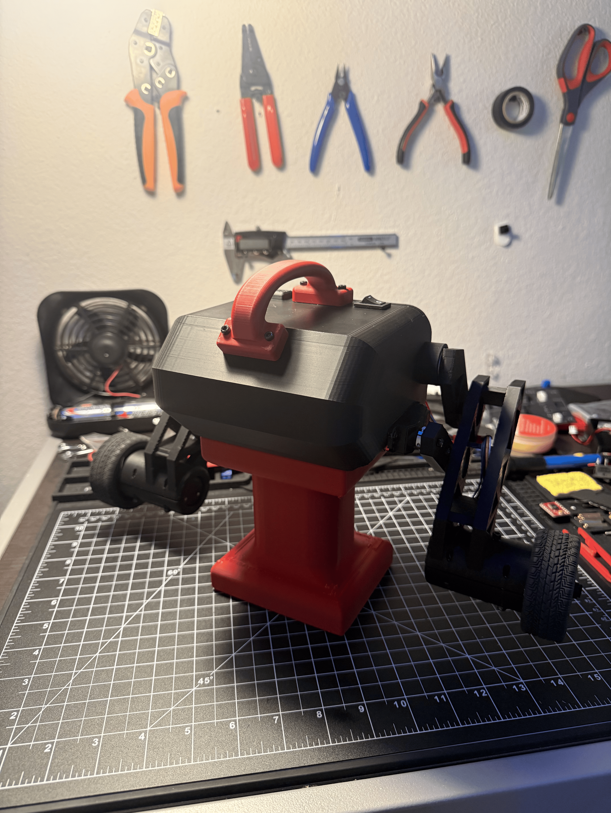
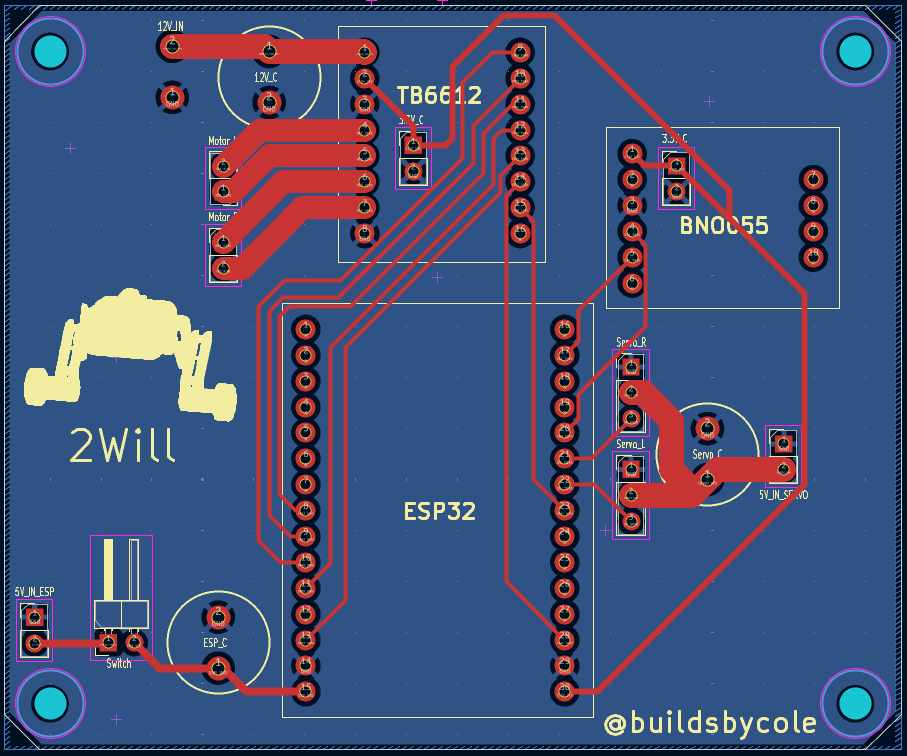
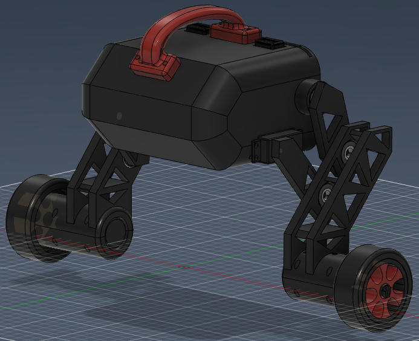
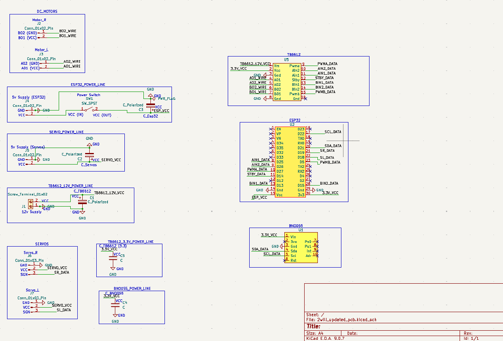

# 2Will — Self-Balancing Robot


2Will is a completed two-wheeled self-balancing robot built with an ESP32, BNO055 IMU, custom PCB, servo-controlled legs, and Xbox controller input.

The robot balances using a PID control loop, supports standing and crouching modes, and can be driven forward, backward, left, and right using the controller.

---

## Project Images

<p align="center">
  
</p>

<p align="center">
  <b>Completed Robot</b>
</p>

<table>
  <tr>
    <td align="center">
      <br>
      <b>Custom PCB</b>
    </td>
    <td align="center">
      <br>
      <b>CAD Model</b>
    </td>
    <td align="center">
      <br>
      <b>Schematic</b>
    </td>
  </tr>
</table>

---

## Demo Video

A full demo of the robot balancing, standing, crouching, and driving can be viewed here:

[Watch the demo on YouTube](https://youtu.be/qkh4CGx9Ii8?si=Ufr1Ie2x1ghSn5a6)

## Overview

This project was built to explore embedded control systems, PCB design, mechanical CAD, and real-time robot balancing.

The robot reads pitch data from a BNO055 IMU and uses a PID loop to calculate the motor output needed to stay upright. It has two balance modes: standing and crouching. Each mode has its own tuning values, target pitch, drive response, turning response, and fall cutoff angle.

An Xbox controller is used to switch positions, control each leg, and drive the robot while it continues balancing.

---

## Features

- Completed two-wheeled self-balancing robot
- ESP32-based embedded control system
- PID balance loop using BNO055 IMU pitch data
- Separate tuning values for standing and crouching
- Servo-controlled legs for standing and crouching positions
- Xbox controller support through Bluepad32
- Forward and backward movement using the left stick
- Left and right turning using the left stick
- Custom PCB for cleaner wiring and hardware integration
- Fall cutoff safety to stop the motors if the robot tips too far
- Build files included for anyone who wants to recreate the project

---

## Hardware

- ESP32 development board
- BNO055 IMU
- TB6612FNG motor driver
- 2 DC motors
- 2 20kg servo motors
- Custom PCB
- 3D-printed frame
- Battery power supply
- Xbox controller

---

## Software

The robot is programmed in C++ using the Arduino framework.

### Libraries Used

- `Arduino.h`
- `Wire.h`
- `Adafruit_BNO055`
- `ESP32Servo`
- `Bluepad32`

---

## Controls

| Control | Action |
|---|---|
| A | Stand |
| B | Crouch |
| X | Toggle left leg |
| Y | Toggle right leg |
| Left Stick Up/Down | Move forward and backward |
| Left Stick Left/Right | Turn left and right |

---

## How It Works

The BNO055 IMU measures the robot's pitch angle. The current pitch is compared to a target pitch, and the PID loop calculates how much motor power is needed to correct the robot's balance.

The robot has separate tuning values for standing and crouching. This allows each position to have its own target pitch, PID response, driving behavior, turning behavior, and safety cutoff.

Forward and backward movement is handled by shifting the target pitch slightly based on the controller input. Turning is handled by adding more motor output to one side and less to the other, allowing the robot to rotate while still balancing.

If the robot leans too far past the safe angle, the motors stop automatically.

---

## Build Files

The `build-files` folder includes the files needed to recreate the physical build:

- Parts list
- Gerber files for the custom PCB
- STL files for the 3D-printed parts

These files are included so others can build, modify, or learn from the project.

---

## Repository Structure

```txt
.
├── builds-files/
│   ├── parts.md
│   ├── gerber-files/
│   └── stl-files/
├── images/
│   ├── robot.png
│   ├── pcb.png
│   ├── cad.png
│   └── schematic.png
├── src/
│   └── main.cpp
├── .gitignore
├── LICENSE
├── platformio.ini
└── README.md